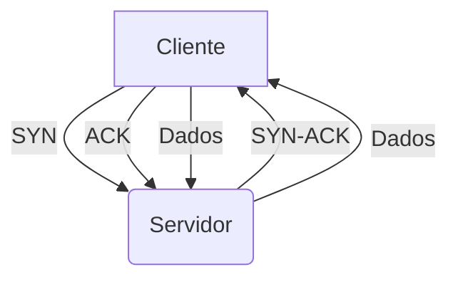

<h1 align="center">Hi! My name is Isaac Camilo and I'm a Data Engineer! 🚀</h1>
<h2 align="center">Data Engineer | Big Data ⚙️</h2>

###

<h2 align="left">Languages and Tools I Know:</h3>

  
  
  
  
  
  
  
  
  
  
  
  
  
  
  
  
  
  

###

<h2 align="left">Social Network:</h3>

  
  

